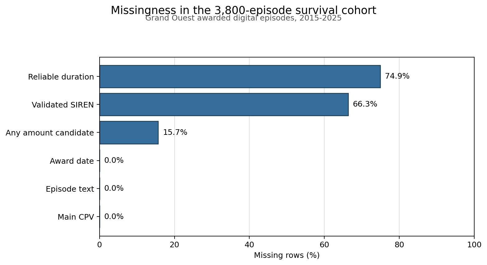

# BOAMP Data Quality Report

Generated: `2026-08-16T16:28:52`  
Data through: `2025-12-31`  
Assessment: **Share with caveats**

## Technical Summary

The processed data are reproducible and internally coherent at their declared grains: `1,620,712` unique BOAMP notices become `1,103,632` reconstructed procurement episodes, and the final study cohort contains `3,800` unique awarded Grand Ouest digital episodes. No duplicate notice IDs, duplicate survival episodes, negative survival durations, impossible episode chronologies, or accepted links with conflicting validated SIRENs were found.

The main risks are measurement rather than pipeline corruption. Validated SIREN is missing for `66.3%` of the cohort, reliable duration for `74.9%`, and the reference labels were generated by a single LLM research pass and spot-checked on a subset rather than verified anchor-by-anchor or judged by an independent specialist. Therefore the linkage and survival results are usable as conservative exploratory evidence, but their reported precision is not an independently established accuracy guarantee.

## Data Grain And Selection

| Layer | Grain | Rows | Main rule |
|---|---|---:|---|
| Standardised data | BOAMP notice | 1,620,712 | Official notices published 2015-2025 |
| Reconstructed data | Procurement episode | 1,103,632 | Explicit links, shared folder IDs, or constrained reference links |
| Study cohort | Awarded digital episode | 3,800 | Grand Ouest, CPV divisions 32/35/48/72, resolved award date |
| Candidate table | Anchor-candidate pair | 763,417 | Same plausible buyer, 90-2,920 days later |
| Survival table | Cohort episode | 3,800 | First accepted successor or administrative censoring |

The source is the official [BOAMP API](https://www.data.gouv.fr/dataservices/api-bulletin-officiel-des-annonces-des-marches-publics-boamp), which publishes procurement notices and results. A notice is not necessarily a distinct contract, so episode reconstruction is necessary before successor linkage.

## Integrity Checks

| Check | Result |
|---|---:|
| Duplicate standardised notice IDs | 0 |
| All notices assigned to exactly one episode | True |
| Buyer-conflict episodes | 0 |
| Impossible episode chronologies | 0 |
| Duplicate survival episodes | 0 |
| Negative survival durations | 0 |
| Accepted links with conflicting validated SIRENs | 0 |
| Accepted municipal/intercommunal entity mixes | 0 |

These checks support structural consistency, not semantic truth. A syntactically valid episode can still combine notices incorrectly, and a plausible successor can still be a different procurement need.

## Missingness And Treatment

| Field | Missing rate | Treatment | Reason |
|---|---:|---|---|
| Validated SIREN | 66.3% | Preserve name-only buyer key; audit risky links | [SIREN](https://www.insee.fr/fr/metadonnees/definition/c2047) identifies a legal unit; [SIRET](https://www.insee.fr/fr/metadonnees/definition/c1841) identifies an establishment, so names alone cannot prove legal identity |
| Reliable duration | 74.9% | No imputation | Completeness changes sharply by year and a universal four-year value would create false expiry dates |
| Any amount candidate container | 15.7% | Do not aggregate as contract value | The container can hold multiple notice-level amount candidates and has no validated canonical awarded value |
| Main CPV | 0.0% | Required by cohort selection | CPV is a hierarchical procurement vocabulary under [Regulation 213/2008](https://eur-lex.europa.eu/eli/reg/2008/213/oj) |
| Episode text | 0.0% | Required by cohort selection | Needed for linkage ranking |
| Award date | 0.0% | Required by cohort selection | Defines survival time zero |

The decision not to impute duration is supported by the observed temporal instability: reliable duration is present for only `11.8%` of 2023 episodes but `84.4%` of 2025 episodes. Missingness is therefore not plausibly exchangeable across years. EU procurement law also treats four years as a general framework-agreement limit with justified exceptions, not as the duration of every contract ([Directive 2014/24/EU, Article 33](https://eur-lex.europa.eu/eli/dir/2014/24/oj)).



## Linkage Coverage And Sensitivity

Candidate generation finds at least one candidate for `3,520` of `3,800` anchors (92.6%). This is candidate availability, not linking accuracy. The primary method accepts `544` links.

| Linkage arm | Events | Event rate | Median observed successor time |
|---|---:|---:|---:|
| Strict text threshold | 296 | 7.8% | 35.7 months |
| Primary text threshold | 544 | 14.3% | 31.8 months |
| Looser text threshold | 853 | 22.4% | 26.6 months |
| Weighted high-recall contrast | 1332 | 35.0% | 26.1 months |

The large event-rate range is a material uncertainty result. Absolute survival probabilities depend on the linkage policy and should be presented with sensitivity analyses.

## Validation Of The Constructed Successor-Event Variable

`event` is a constructed, linkage-conditioned proxy, so it is validated here
before it is used in survival analysis. This is the canonical account; the
detailed tables live in the artifacts each subsection names.

**1. Definition.** `event = 1` when a later Grand Ouest procurement episode is
accepted as the observable successor of an awarded cohort episode under the
frozen linkage rule, and the survival time is the award-to-successor gap.
`event = 0` when no successor is accepted before `2025-12-31`, and the row
is administratively right-censored. `event = 0` is **not** evidence that the
procurement was never renewed or re-procured: it may have been re-procured
outside BOAMP, through a central purchasing body, below publication thresholds,
or through a successor the linkage rule failed to recover.

**2. Candidate generation.** A later episode is exposed for comparison only when
buyer evidence is plausible, validated SIRENs do not conflict, and it is
published between 90 and 2,920 days after the award. This produced
`763,417` pairs covering
`3,520` of
`3,800` anchors. The window is an operational
search range, not an assumed contract duration.

**3. Scoring rule.** `M_B_text_ranking` selects the single highest TF-IDF cosine
candidate per anchor and accepts it when that similarity reaches the threshold.
At most one successor is selected per anchor; otherwise the method abstains.

**4. Frozen threshold.** `0.70`, fixed a priori on a precision-first principle,
because a false link fabricates both a survival event and its event time. It was
not moved after the regional reference was read — which is the only reason the
locked split can be reported as held out — and it was not tuned toward any target
event rate. The internship guide's 40-60% linkage expectation was treated as a
planning figure, never as an optimisation target; the realised
`14.3%` is a consequence of the precision-first rule,
not a miss against a goal.

**5. Reference design.** A stratified set of `120` Grand
Ouest anchors labelled on `2026-08-11`, before these linkage methods
existed. The project owner supplied the raw anchor and candidate data; a single LLM
research pass consulted the BOAMP notices, their official URLs, and wider public
sources, and proposed a successor or an abstention per anchor; the project owner
then spot-checked a subset rather than verifying every anchor.
`112` resolve onto exactly one
procurement episode through their BOAMP notice identifiers; the rest were dropped
rather than guessed. This is a reference sample, not ground truth, and the
per-anchor evidence trail was not recorded. See `REGIONAL_BENCHMARK_REFERENCE.md`.

**6. Reference performance.** On the locked split
(`72` evaluable anchors: `18`
with a reviewed successor and `54` without), exact-successor
accounting gives TP `7`, FP
`1`,
FN `10`, TN `54`:
precision `0.875` (95% CI
`0.529`-`0.978`),
recall `0.389` (95% CI
`0.203`-`0.614`),
false-positive rate on reviewed negative anchors
`0.000`. Both event-positive and event-negative
situations are represented, so all four cells are populated. Recall is additionally
capped at `0.913`
by candidate generation, before any method runs. Intervals matter at this sample
size — see `QUALITY_EVIDENCE.md`.

A caveat binds cell 6 in particular: reference negatives are corpus-relative,
because roughly 25 candidates per anchor were considered rather than the full pool.
An accepted link on an anchor labelled negative counts as an error even when the
research pass never saw that candidate, so the figure is conservative by
construction: it can overstate error but not understate it. It remains a
diagnostic on this sample rather than a population-wide false-positive rate — the
reference is a stratified sample with design weights spanning 1 to 68, and
`0.000` on
`54` negative anchors still carries a wide interval.

The checks in cells 6 to 9 — reference scoring, threshold and borderline
sensitivity, and the linked-versus-unlinked comparison — follow the
linkage-quality evaluation strategy set out by
[Harron et al. (2017)](https://doi.org/10.1093/ije/dyx177). That source supports
the strategy, not these numbers.

**7. Threshold sensitivity.** Four retained arms span the event definition:

| Arm | Events | Event rate | Median observed successor time |
|---|---:|---:|---:|
| `M_B @ 0.80` strict | 296 | 7.8% | 35.7 months |
| `M_B @ 0.70` primary | 544 | 14.3% | 31.8 months |
| `M_B @ 0.60` loose | 853 | 22.4% | 26.6 months |
| `M_C @ 0.70` contrast | 1332 | 35.0% | 26.1 months |

**8. Borderline-case robustness.** Excluding every anchor whose best candidate
scores within `±0.05` of the threshold removes `280` episodes
and `133` events. The direction of both headline hazard ratios
survives (CPV-35 `1.55` to
`1.78`; framework
`1.75` to
`1.62`), while the absolute KM
level moves. Comparative claims are therefore not driven by borderline linkage
decisions; absolute probabilities remain threshold-uncertain. See
`survival_borderline_link_sensitivity.csv`.

**9. Linked versus unlinked detectability.** Standardised mean differences between
event-positive and event-negative episodes are largest for
`text_length_chars` (SMD `+0.262`), `framework_flag` (SMD `+0.187`), `administrative_followup_months` (SMD `+0.146`), `award_year` (SMD `-0.137`).
Longer episode text is linked more often, which is consistent with text-similarity
scoring having more to work with. Framework agreements are linked more frequently;
this may reflect genuine recurrence behaviour, differential linkability, or both,
and this evidence cannot separate them. Award-year differences are confounded with
unequal follow-up. See `survival_selection_diagnostic.csv`.

**10. Implications for survival interpretation.** Every survival quantity is
conditional on this event definition. Missed successors may reduce the observed
event rate, whereas residual false links may increase it, so the estimates are
**not** formal lower bounds on true re-procurement probability. The defensible
claims are comparative — which segments and contract types show an observable
successor sooner — supported by the four-arm and borderline checks. Absolute
probabilities must be quoted with their sensitivity range. Out-of-time Cox
discrimination is weak (test C-index `0.479` on
`2022-2024`), so the Cox layer is descriptive and no individualised
prediction claim is made.

## Reference Evidence Quality

Linkage accuracy is read against the Grand Ouest regional reference: `120` anchors reviewed against real BOAMP notices, of which `88` are evaluable once each anchor is resolved onto exactly one procurement episode. The labels were produced before these linkage methods existed and are therefore independent of every method they score.

Three limits remain. The labels were generated by a single LLM research pass over the notices, their official URLs, and wider public sources, then spot-checked on a subset by the project owner rather than verified anchor-by-anchor, and they are not an independent specialist panel. The sources behind each individual label were not recorded, so a given anchor's evidence trail cannot be fully reconstructed. Negatives are corpus-relative because roughly 25 candidates per anchor were considered. Recall is additionally capped at `0.913` by candidate generation, before any method runs.

This is the main unresolved validation risk. The appropriate correction is an independent specialist review of a compact, stratified sample, especially accepted links, method disagreements, high-similarity structural negatives, and name-only buyer matches.

## Defensible Use

- Safe: describe the pipeline as identifying **observable successor procurements**.
- Safe: use `M_B_text_ranking @ 0.70` as a provisional precision-first operating baseline.
- Safe: report sensitivity across linkage thresholds and methods.
- Not safe: call the events confirmed legal renewals.
- Not safe: call 0.80 an independently validated precision guarantee.
- Not safe: use the episode-level amount candidates for monetary trend conclusions.

## Reproduction

```bash
PYTHONPATH=. python3 scripts/build_project_evidence.py
PYTHONPATH=. jupyter nbconvert --execute --to notebook --inplace notebooks/14_data_quality_and_trend_analysis.ipynb
PYTHONPATH=. pytest -q
```
