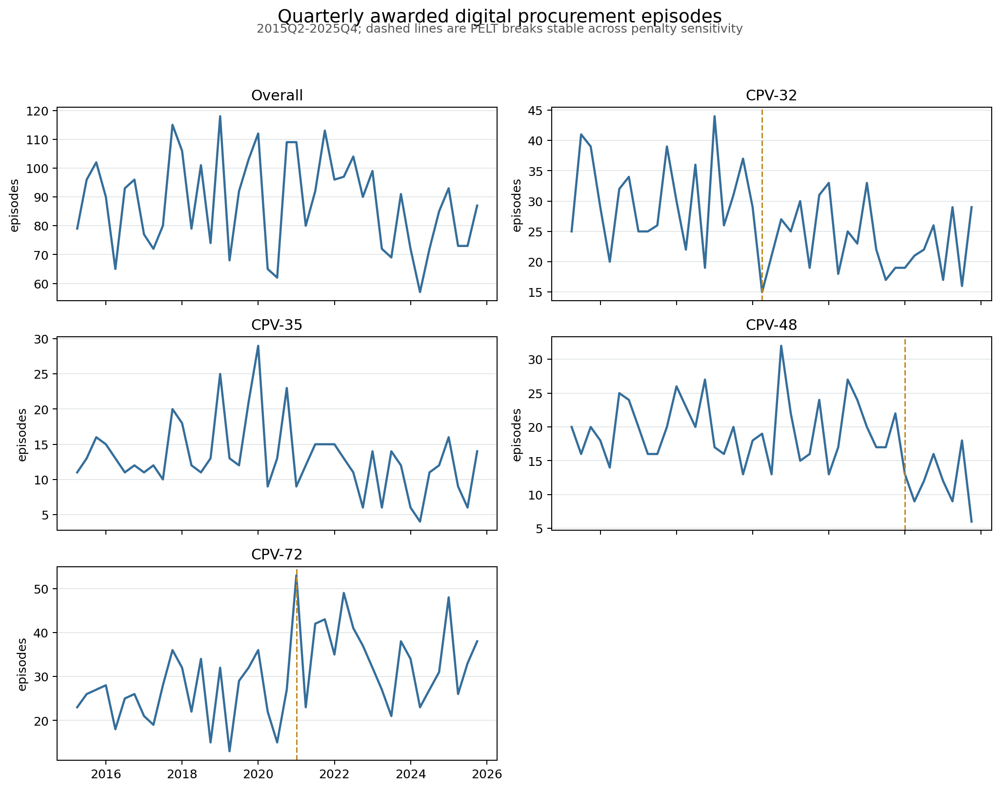
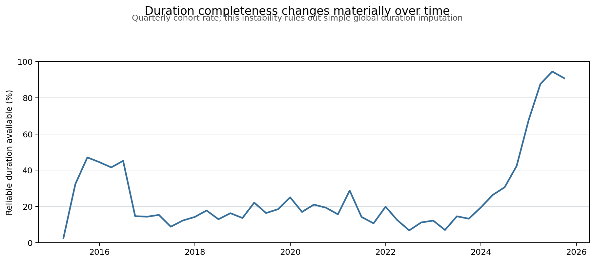

# BOAMP Descriptive Trend Analysis

Generated: `2026-08-16T16:28:53`  
Analysis window: `2015Q2-2025Q4`  
Unit: awarded Grand Ouest digital procurement episodes

## Technical Summary

This analysis adds the guide's missing time-series component without claiming a forecast. Quarterly episode counts are examined for the overall cohort and CPV divisions 32, 35, 48, and 72. PELT identifies candidate mean shifts, penalty sensitivity distinguishes stable from fragile breaks, and a 12-quarter linear slope describes the current direction.

The results are descriptive signals only. Breaks are not automatically attributed to policy, technology, or COVID; those explanations require documentary evidence and stakeholder validation. Amount trends are omitted because the episode layer carries multiple unvalidated amount candidates rather than one canonical awarded amount.

## Current Signal Matrix

| Segment | Recent direction | Episodes/quarter slope | Exploratory p-value | Last stable PELT break | HMM regime |
|---|---|---:|---:|---|---|
| Overall | stable_or_uncertain | -0.11 | 0.921 | -- | growth |
| CPV-32 | stable_or_uncertain | -0.01 | 0.989 | 2020Q2 | growth |
| CPV-35 | stable_or_uncertain | 0.03 | 0.923 | -- | -- |
| CPV-48 | decreasing | -0.84 | 0.032 | 2024Q1 | -- |
| CPV-72 | stable_or_uncertain | 0.70 | 0.285 | 2021Q1 | growth |

`stable_or_uncertain` means the 12-quarter slope is not distinguishable from zero at the pre-declared exploratory level α = 0.10. These p-values are descriptive and are not corrected for multiple testing.

## Operational Reading

Each row translates that segment's own signals into a monitoring action. These are
readings of the descriptive evidence, not causal explanations and not forecasts: a
PELT break marks where the series level shifted, never why, and no recommendation
below should be quoted as attributing a shift to policy, COVID, regulation, or
technology.

| Segment | Recent direction | Recommendation |
|---|---|---|
| Overall | stable_or_uncertain | Maintain monitoring for Overall; no statistically clear recent direction at the pre-declared exploratory level. The HMM currently reads this series as `growth`, which describes recent quarter-over-quarter change and need not agree with the 12-quarter slope. |
| CPV-32 | stable_or_uncertain | Maintain monitoring for CPV-32; no statistically clear recent direction at the pre-declared exploratory level. A penalty-stable level shift is dated 2020Q2; treat it as a break candidate to be explained with documentary evidence, not as a demonstrated cause. The HMM currently reads this series as `growth`, which describes recent quarter-over-quarter change and need not agree with the 12-quarter slope. |
| CPV-35 | stable_or_uncertain | Maintain monitoring for CPV-35; no statistically clear recent direction at the pre-declared exploratory level. |
| CPV-48 | decreasing | Investigate the recent decline in CPV-48 before reducing or expanding procurement capacity; confirm whether it reflects demand, publication practice, or a routing change to another channel. A penalty-stable level shift is dated 2024Q1; treat it as a break candidate to be explained with documentary evidence, not as a demonstrated cause. |
| CPV-72 | stable_or_uncertain | Maintain monitoring for CPV-72; no statistically clear recent direction at the pre-declared exploratory level. A penalty-stable level shift is dated 2021Q1; treat it as a break candidate to be explained with documentary evidence, not as a demonstrated cause. The HMM currently reads this series as `growth`, which describes recent quarter-over-quarter change and need not agree with the 12-quarter slope. |

## Stationarity (ADF/KPSS)

| Segment | ADF (H0: unit root) | KPSS (H0: level stationary) | Note |
|---|---|---|---|
| Overall | ADF stat=-5.890, p=0.000 | KPSS stat=0.268, p=0.100 | |
| CPV-32 | ADF stat=-6.086, p=0.000 | KPSS stat=0.808, p=0.010 | |
| CPV-35 | ADF stat=-1.684, p=0.439 | KPSS stat=0.444, p=0.058 | |
| CPV-48 | ADF stat=-1.749, p=0.406 | KPSS stat=0.545, p=0.032 | |
| CPV-72 | ADF stat=-5.439, p=0.000 | KPSS stat=0.611, p=0.022 | |

ADF and KPSS test opposite null hypotheses, so they are read together rather than
individually. A series that rejects the ADF unit-root null while failing to reject
the KPSS stationarity null is consistent with level stationarity around a constant
or slowly varying mean; disagreement between the two tests indicates the series is
not cleanly classified as stationary or non-stationary over this short window. These
diagnostics describe the fitted quarterly series; they are not used to justify or
rule out forecasting, which remains out of scope.

## Regime Detection (HMM)

A 3-state Gaussian hidden Markov model is fit on the quarter-over-quarter change in
episode count (not the level) for the overall cohort and the two highest-volume CPV
segments, so the three states describe typical period-over-period direction —
`decline`, `plateau`, `growth` — rather than the segment's absolute activity level. A
segment can hold a high or low count while still sitting in a `plateau` regime if its
recent changes are small. The reported probability is the model's posterior
probability of the current-quarter regime, not a forecast, and a detected regime is
not a causal explanation of any prior shift.

| Segment | Current regime | Probability | Mean quarterly change by regime |
|---|---|---:|---|
| Overall | growth | 0.750 | decline=-15.5, plateau=-7.8, growth=17.8 |
| CPV-32 | growth | 0.992 | decline=-12.3, plateau=-0.5, growth=11.6 |
| CPV-72 | growth | 0.594 | decline=-6.6, plateau=0.1, growth=7.5 |

Because the model is fit on noisy, low-count quarterly series, the `plateau` state is
a data-driven middle tier rather than a change centered exactly at zero; its mean
change should be read alongside `decline` and `growth` rather than interpreted as
"no change." The HMM's current-regime label and the 12-quarter OLS slope above are
complementary, not identical: the OLS slope summarizes the last 12 quarters, while
the HMM regime reflects the model's belief about the most recent quarter's state and
can differ from the OLS signal without either being wrong.

## Method

For segment $s$ and quarter $q$, the count is

\[
N_{s,q}=\sum_i \mathbf{1}(S_i=s, Q_i=q),
\]

where $S_i$ is the episode's CPV division and $Q_i$ is its award quarter. The partial first quarter of 2015 is excluded; all quarters from 2015Q2 onward are represented, including zeros.

PELT minimizes a penalized segmentation objective,

\[
\sum_{r=0}^m \mathcal{C}(y_{\tau_r+1:\tau_{r+1}})+\beta m,
\]

where \(\mathcal{C}\) is within-segment squared error, \(m\) is the number of breaks, and \(\beta=\lambda\log(n)\) after z-standardization. The first term rewards fitting each segment well; the second charges a fixed price per break, which is what stops the optimum from placing a break between every pair of quarters. The central result uses \(\lambda=1\); sensitivity uses 0.5 and 2.0. A break is called stable only when a break lies within one quarter under all three penalties. This follows the PELT framework of [Killick, Fearnhead and Eckley (2012)](https://doi.org/10.1080/01621459.2012.737745).

The HMM is fit on the quarter-over-quarter change \(\Delta N_t = N_t - N_{t-1}\). Its hidden state \(Z_t \in \{\text{decline}, \text{plateau}, \text{growth}\}\) evolves through transition probabilities \(P(Z_t=k \mid Z_{t-1}=l)\), and the regime probability reported above is the posterior

\[
P(Z_t=k \mid \Delta N_1,\dots,\Delta N_t),
\]

that is: given the observed sequence of quarterly changes and the fitted model, how probable is regime \(k\) in the current quarter. It is model-conditional and is not an observed property of the market.

The recent direction comes from an ordinary least-squares fit over the latest 12 quarters,

\[
N_t=\alpha+\beta t+\varepsilon_t,
\]

where \(\hat\beta\) is the estimated change in awarded episodes per quarter over that window. A segment is labelled `increasing` or `decreasing` only when \(\hat\beta\)'s two-sided p-value is below 0.10; otherwise it is `stable_or_uncertain`. This is a signal description, not a forward prediction, and no value of \(N_t\) beyond the window is implied.

## Duration Completeness Is A Measurement Break

The sharp rise in duration availability in 2025 is a schema/completeness change, not evidence that contract durations suddenly changed. Median-duration trend claims would mix periods with substantially different observation processes, so the report does not run change-point detection on duration values.

## Limits

- The series cover awarded digital episodes, not every procurement notice or every French contract.
- CPV divisions are broad operational segments, not the 8-12 class supervised taxonomy proposed in the internship guide.
- Count changes can reflect publication practice, schema changes, buyer coverage, or procurement activity.
- PELT proposes candidate breaks; it does not identify their causes.
- Monetary trends remain unavailable until one awarded-value definition is validated.

## Reproducible Outputs

- `data/processed/boamp/trend_quarterly.csv`
- `data/processed/boamp/trend_breakpoints.csv`
- `data/processed/boamp/trend_signal_matrix.csv`
- `data/processed/boamp/trend_analysis_summary.json`
- `notebooks/14_data_quality_and_trend_analysis.ipynb`
